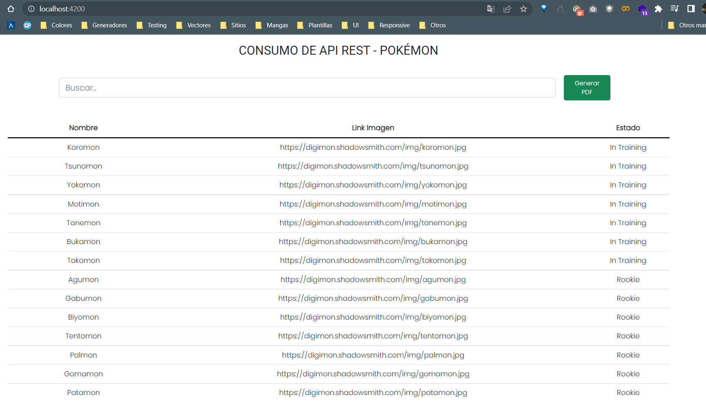
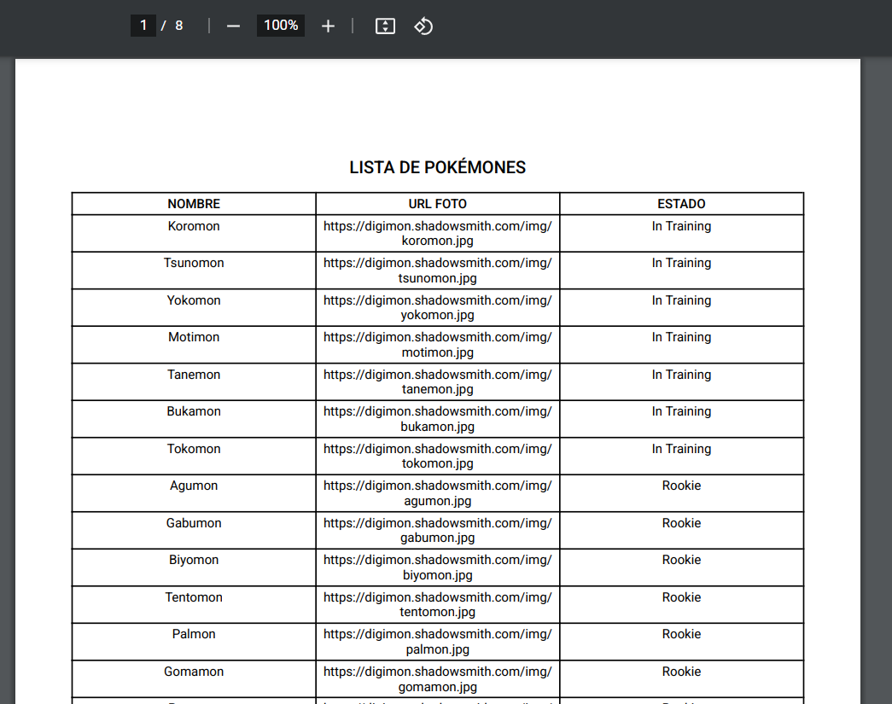

# POKÉMON

Para este pequeño proyecto vamos a utilizar una data sobre pokémones **https://digimon-api.vercel.app/api/digimon** para después
pasar a consumirlo con Angular. En la que listaremos los pokémones en una tabla y añadiremos un filtro para facilitar su busqueda. Posteriormente utilizaremos la librería **pdfmake-wrapper** para diseñar un formato y exportar toda la lista
de pokémones en un PDF. En realidad es un proyecto super sencillo, pero que servirá de base para entender la libreria y el consumo de APIS.

### Web

### Pdf

