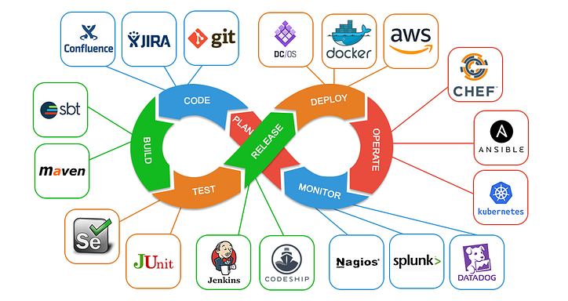
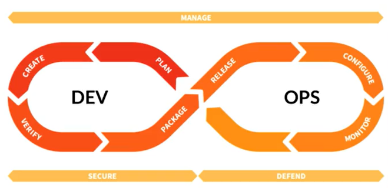
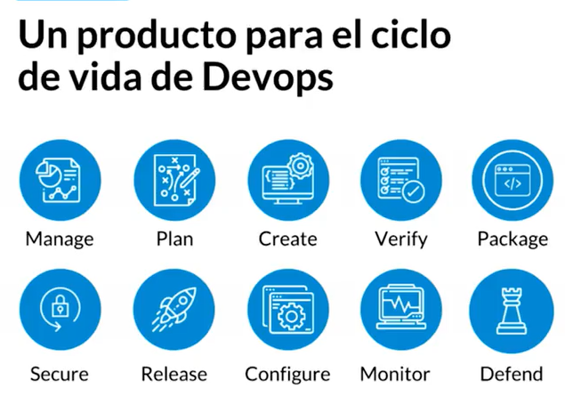

## ¿Qué es DevOps?
Si escribes código, eres también responsable que corra en producción.

- Desarrollador: Escribe el código con las reglas de negocio, se encarga de la seguridad dentro del código, empaquetar el código.
- Operaciones. Configuración de servidores, redes para que el software se ejecute sin problemas.
- Alguien que practica DevOps, se encarga que el proceso de desarrollo y puesta en producción (operaciones), sea seguro, automatizado y de calidad.
- Pruebas Automatizadas: Unit Test automatizadas que aseguren la calidad. (Test Drive Developer)
- Continius Integration (CI): Asegurando que el código que se integre continuamente sea de calidad.
- Continius Delivery (CD): nos da una estrategia para desplegar las aplicaciones continuamente y entregarlo.
- Monitoreo y logging: para detectar problemas oportunamente.
- Microservicios: separar las funcionalidades de las aplicaciones de servicios independientes.
- Colaboración y comunicación continúa.
  
## El ciclo de vida de DevOps

Herramientas que se puede utilizar:

Ciclo DevOps. Infinity Loop, Mejora Continua.

- Planificación: Definimos los requerimientos, usamos issues, boards.
- Desarrollo o crear: Escribir código, uso de repositorios.
- Verificación: Pruebas Automatizadas, definimos las reglas para que el software se de calidad.
- Empaquetado: Compilación de código para la puesta a producción, usamos contenedores.
- Despliegue o Release: Nuevas versiones, CD, puesta a producción.
- Configuración: Realizar los cambios para que la aplicación se ejecute correctamente.
- Monitoreo: Verificar la performance de la aplicación.
Mientras desarrollamos debemos de asegurar nuestra aplicación y cuando ya se encuentra en producción debemos defender.

#### Beneficios DevOps

- Velocidad: entregas rápidas, automatización.
- Rápida distribución: CD, cambios diarios
- Confiabilidad: Por la automatización de procesos
- Escala: Podemos escalar nuestra infraestructura
- Colaboración: mejora de procesos
- Seguridad: a través de pruebas automatizadas.

## ¿Qué es Gitlab?

Gitlab no tiene oficinas. Es Open Source.

Es un producto especializado en el ciclo de vida de devops. Nos dá todas las herramientas para asegurar el ciclo de vida devops.

Está compuesto por:

- Manage: opciones de autenticación, autorización, analytics.

- Plan: issues, milestones, opciones de colaboración dentro de GitLab. especializado en el desarrollo agil.

- Create: crear proyectos y grupos, repositorios de grupos, merge requests, integración y automatización.

- Verify: pruebas automatizadas, calidad del codigo, review apps, code coverage. (Todo esto a través de GitLab CI).

- Package: nos permite empaquetar nuestro código. (Container REgistry, paquetes privados - NPM y Maven)

- Distribution (Release): Distribuir el codigo de manera agil.

- Configuración: auto devops, integración con kubernetes,

- Monitoreo: gitlab se apoya de 3 proyectos open source para visualizar performance, salud y tracing de la plataforma junto con sus errores: prometheus, jaeger, sentry

- Secure: cuando desarrollamos código exponemos vulnerabilidades, gitlab no ayuda con los lectores de ataque.

- Defense: No solo aseguramos el código, tambien lo defendemos con gitlab (firewalls).

## Módulo de Administración

### Autenticación
Existen muchas formas de autenticarse:
- Username/Password (loginm)
- 2FA (OTP y FIDO U2F)
- SSH key (Push Code)
  
### Grupos

Permiten compartir recursos entre varios miembros del equipo y poder organizar la forma en que trabajamos; permiten:

- Agrupar proyectos
- Otorgar permisos de acceso
- Compartir recursos
 
También se les conoce como subgrupos, permiten modelar la forma en la que nuestra compañia está diseñada (osea sus áreas o equipos), por ejemplo un grupo de devs, administrativos o ejecutivos. El hecho de que creemos grupos es para establecer reglas de seguridad para que otros grupos por ejemplo no visualicen lo que no les pertenece.

Los grupos se utilizan en GitLab a traves de "NAMESPACES", lo que nos dará una url única para usuario, nombre de grupo y/o subgrupos.

Nombres reservados para los grupos, las palabras reservadas son: https://docs.gitlab.com/ee/user/reserved_names.html

Hay palabras reservadas que no pueden tener los grupos, como: commits, create, files, new, wikis, etc.

##### Tipos de visibilidad

- Pública: cualquier usuario puede ver los contenidos de ese grupo 
- Interna: adentro de la instancia de GitLab (usuarios logueados) pueden tener acceso a ese grupo.
- Privada: Proyectos y grupos sean accesibles a traves de los permisos que se asignan en GitLab.
    
##### Autorización
Permisos de Grupo
- Guest: solo Lectura.
- Reporter: pueder abrir y comentar issue, no puede añadir código (no puede hacer push).
- Developer: Subir código, acceso a issue, branches, etc, pero no puedes añadir miembros o configurar el proyecto.
- Owner / Maintainer: Puede realizar configuraciones del proyecto + Dev. (Owner → creador del proyecto. Maintainer → no creador del proyecto)

##### Auditoria
Poder tener un rastro de auditoría que podremos usar en caso de que haya algo sucedido mal, y un log se crea por ejemplo, si agregamos un usuario al subgrupo, eliminamos, etc. Te da una información detallada, la fecha y hora, quien lo hizo, etc. Es necesario tener un plan para poder hacer uso de este privilegio.

Gitlab nos permite registrar rastro de auditoria sobre el Grupo, proyecto o instancia (y muchos más)

Existe un rastro de auditoría el cual va evolucionando y nos provee de puntos de datos.

Todos los cambios quedan auditados sin posibilidad de modificarlos. De esta manera se puede determinar la causa del problema.

###### Proyectos
Los proyectos tienen 3 componentes fundamentales:
- Issue tracker: es especifico para equipos que desarrollan software y que trabajan de manera agil, por lo tanto encontraremos dentro conceptos de pesos, estimados de tiempos, sprints, etc.
- Code repository: es el lugar que nos permiten almacenar y compartir el código fuente.
- Gitlab CI: es la integración continua que aplica el equipo.
  