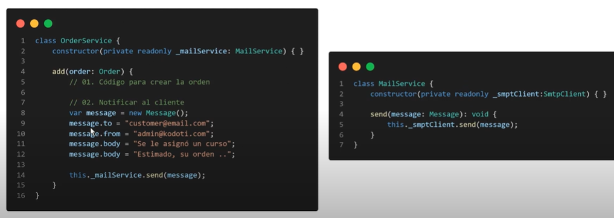
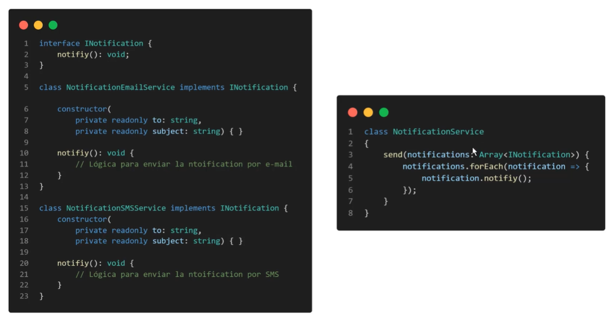
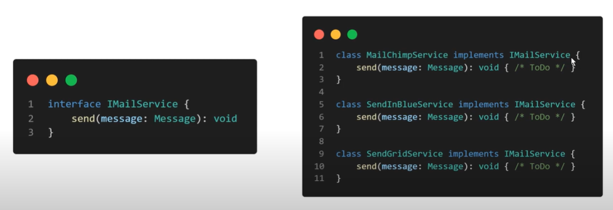

## PRINCIPIOS SOLID:

Propuesta por **Robert C. Martin** en el 2000.

Son recomendaciones para escribir un código mantenible, escalable y robusto. La idea es implementar unos principios para que el código sea limpio y mantenible con el paso del tiempo.
No es mandatorio, son recomendaciones.

Beneficios:

- Alta Cohesión: se refiere a la colaboración entre clases.
  
- Bajo acoplamiento: Evitar que una clase dependa fuertemente de otra clase.
  
### Responsabilidad unica
Una clase debe de tener una razón para existir y debe de realizar una unica cosa.
Ejemplo: hacemos que una clase gestione la información del usuario y le solemos dar una responsabilidad que no están dentro del dominio del usuario, entonces estamos rompiendo este principio.

Hay dos métodos, uno que de verdad si le pertenece a esa clase y otra que no debería.

##### Solución:
Debemos de promover la cohesión y crear otra clase, y que estás colaboren entre si.
Asi que en vez de crear el método "sendCustomerNotification" crearemos una nueva clase.
De esta manera sel código se hace más sencillo porque si queremos modificar algo en el envio de mensaje, pues simplemente lo hacemos en su propia clase.

### Abierto - Cerrado
Las piezas (clase o función) del software deben estar abiertas para la extensión pero cerradas para la modificación. Si es posible deberiamos evitar la modificación de esta.

Podemos ver dicha clase recibe un Array de notificaciones. El problema es que como vemos este quiere saber que tipo de notificación enviar y por eso juega con type, si es sms llamará al método sendbySMS y si es email llamará a sendbyEmail. Entonces aquí se rompre el principio, ¿por qué?, porque si queremos agregar otro canal de comunicación como wathsapp vamos a tener que modificar el codigo de la clase NotificacionService y no es lo correcto. 

##### Solución:
Lo mejor es extenderlo utilizando el polimorfismo. Tenemos una interface y dadicionalmente dos clases, una para enviar el correo y otra para enviar el mensaje SMS.
Hemos actualizado la clase NotificationService y ahora recibe como párametro la interface en vez de directamente hacerlo con la clase. De esta manera a través de la abstracción **NotificationService** es capaz de trabajar con cualquier proveedor de notificación. Entonces si en un futuro queremos agregar otro canal de comunicación, le creamos su clase e implementamos la interface y internamente NotificationService queda cerrado para su notificación. De esta manera hacemos un código escalable y fácil de mantener en el tiempo.

### Sustitución de Liskov
Las clases subtipos deberian ser reemplazables por sus clases padres. Es un tema de netamente de herencia, osea las clases subtipos deben de ser de la clase base o padre.

El siguiente ejemplo dice que hay una clase padre llamado animal con los métodos de caminar, correr y cazar. Luego hay otras dos clases hijas, la clase Tigre si puede implementar esos tres métodos de la clase, pero la clase Tortuga no, está no corre ni mucho menos caza. Aunque lo común es ponerle una excepción ya que esos dos metodos no se pueden implementar, pero en realidad estamos en un caso de un pésimo diseño.

##### Solución:

La solución es implementar interfaces independientes para cada comportamiento del animal. Así le decimos que cada animal implemente cada comportamiento que le interesa. De esta manera evitamos escribir un código que sea propenso a errores por un mal diseño.

### Sagregación de Interfaz
Varias interfaces funcionan mejor que una sola.
Dividir y conquistar, no tengamos una interface con muchos métodos, sino hagamos una versión mas ligera de ella.

Por ejemplo, tenemos una interfaz repositorio con todos los métodos CRUD.
La clase UserRepository lo usa y está correcto, porque el usuarioRepositorio puede hacer todas estas acciones.

Ahora, que pasa si teneos un usuarioReportRepository y este solo tiene, ¿acceso a lectura?, no puede hacer todas las acciones y la interface nos obliga a implementarlo.

##### Solución:
Entonces aqui debemos de dividir y conquistar, hacer interfaces mas pequeñas, se parece a la de Liskov (pero es diferente engoque porque trata de las clases sub tipo).

Al definir interfaces más pequeñas podemos hacer que el código sea más escalable. UsuarioRepository ahora puede implementar la interfaz de lectura y ya no está obligado a implementar todos los demas métodos.

### Inversión de Dependencia
Las clases de alto nivel no deben de depender de las clases de bajo nivel.
Indirectamente lo hemos utilizado porque varios frameworks hacen uso de patrones que implementan este principio. 

Tenemos una clase OrderService para generar la creación de las ordenes y luego crearlo mandará una notificacion al cliente, por lo tanto para enviar una notificación hara uso del proveedor MailChimp (proveedor para envio de correos masivos). Ha simple vista el código cumple su cometido y funciona bien, pero que pasa si mañana se necesita trabajar con otro proveedor, pues entonces tenemos que modificar todas las dependencias que hagan referencia a MailChimpService y por lo tanto se rompe el principio porque la clase de alto nivel OrderService no deberia de depender la clase de bajo nivel como MailChimpService.

##### Solución:
La solución es crear una interface y al crearlo podemos crear varias clases que implementen IMailService.

Y esto nos soluciona el tema de la dependencia, es decir la fuerte deependencia a la clase de MailChimpService, porque ahora trabajamos con la abstración, es decir con la interface, ya no nos interesa quien esta pode detras de la interface, lo unico que nos importa es que lo implemente.

Hoy quiero trabajar con MailChimpService, otro dia con SendInBlueService, o tal vez SendGridService. No hay que modificar el código, en este caso solo modificar la instancia, lo demás se mantiene.

