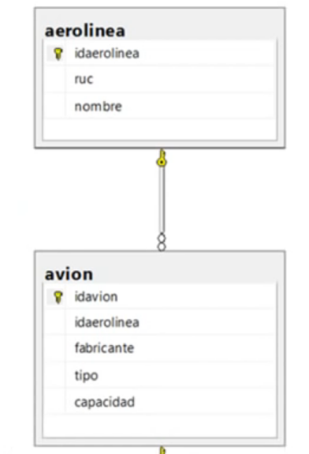

### RELACIONES: 
El modo de relacionar tablas es mediante referencias para lo cuales se usan los identificadores definidos como claves primarias o foráneas.

##### Clave Primaria:
Una clave primaria es un campo o una combinación de camposque identifica de forma única a una tabla. No puede haber dos filas que tengas la misma clave primaria. Una clave primaria debe de ser un campo clave que identifique a dicha tabla, ejem: para persona puede ser DNI y para un libro el ISBN.

##### Clave Foranea:
Esta clave es una limitación referencial entre dos tablas. Esta clave referendo debe de ser la clave primaria de la tabla referenciada.

Ejemplo:

> ALTER TABLE AVION
> ADD CONSTRAINT FK_AVION_AEROLINEA
> FOREIGN KEY (idaerolinea) REFERENCIES AEROLINEA (idaerolinea)
> go

Eliminar la relación:

> ALTER TABLE AVION
> DROP CONSTRAINT FK_AVION_AEROLINEA

Tener en cuenta que la tabla que alteras o modificas es aquella que tienen la clave foranea.

### COMANDOS
Crear: > CREATE DATABASE Prueba1
Eliminar: > DELETE DATABASE Prueba1
COPIA DE SEGURIDAD:
> BACKUP DATABASE NorthWind
> TO DISK = 'D:\Backup_Database_Northwind

https://www.youtube.com/watch?v=ORrPEsOvHd0

// -------------------------------------------------------------------------//
#### Procedimientos Almacenados
Es una herramienta que permite recibir parametros de entradas y devolver valores de salida como resultado a una app que realice la llamada. Asi mismo, nos sirven para ejecutar las instrucciones de programación que ejecutan acciones dentro de la base de datos.

