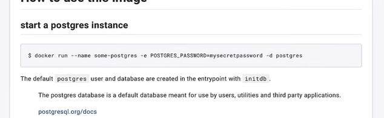

# Comandos básicos

Podemos descargar una imagen y generar un contenedor en base a esa imagen.
  
#### Buscar imagenes en Docker Hub
https://hub.docker.com/
#### Descargamos la img
```docker pull mongo```
#### Ver la imagenes descargadas
```docker images```
####  Crear un contenedor: 
``` docker container create example ```
  Esto crea un identificador el cual se puede utilizar para incializarlo.
#### Iniciar Contenedor
  ``` docker start b0fba....```
##### Verificar la instancia o listar los contenedores
  ```docker ps -a```
  Si solo queremos los activos le quitamos el **-a**
#### Se puede crear más de un contenedor utilizando la misma imagen, ya que el identificador es diferente.
``` docker container create example ```
#### Eliminar una imagen (primero se debe de eliminar el contenedor)
```docker rmi mongo```
#### Listar todos los contenedores (incluso los no iniciados)
```docker ps -a ```
#### Eliminar un contenedor
```docker rm 558acb..```
#### Parar la ejecución (detener) de un contenedor
```docker stop 82bn2... ```
#### Uso de los tags
Sirve para cuando se quiera descargar una imagen en especifica de docker hub.
```docker pull mongo:7.0.2```
#### Eliminar dos imagenes en una sola linea (ejemplo si ambos son de mongo)
```docker rmi mongo:6 mongo:latest```
#### ver solo los ID'S de las imagenes
```docker images -q```
#### Eliminar todas las imagenes sin especificarlo individualmente
```docker rmi $(docker images -q)```

## COMANDOS PARA CONTENEDORES
#### Crear un contenedor
```docker container create mongo:7.0.5```
en docker desktop verás al contenedor pero con un nombre por defecto
#### Iniciar un contenedor
```docker start 2d3652...```
También puedes utilizar el nombre del contenedor en lugar del identificador
#### Crear un contenedor con un nombre personalizado
```docker create --name mongodb mongo:7.0.5```
#### Parar o detener un contenedor
```docker stop mongodb```
También podemos detenerlo con el identificador.

## MAPEO DE PUERTOS PARA ACCEDER A DESDE LA COMPUTADORA AL SISTEMA QUE MANEJA DOCKER INTERNAMENTE
```docker create -p27017:27017 --name mongodb mongo```
  El puerto izquierdo es el puerto disponible en la pc y el derecho es el puerto el cual maneja docker en el contenedor.
  De esta manera creamos un contenedor, asignamos el puerto y acceder para trabajar con ello.

### DOCKER RUN
Este comando ejecuta 3 pasos:
  - Buscar y descarga la imagen
  - Crea un contenedor
  - Inicia el contenedor

De esta manera ya no es necesario hacer los pasos individualmente, pero tbn podemos personalizarlo.
```docker run -p27020:27027 --name mongodb -d mongo```

### DOCKER LOGS
#### Ver los logs
```docker logs mongodb```
#### Ver los logs (más detalles)
```docker logs mongodb --details```
#### Comando para visualizar los logs en tiempo real
```docker logs --follow mongodb```
#### Ver logs pero solo especificando unas lineas de visualización
```docker logs --follow --tail 1 mongodb```
#### Hacer consultas a los logs
Como podemos observar en en logs tenemos diferentes campos que usar, por ejemplo la fecha:
```docker logs --since 2024-02-17```
#### Revisar el logs de l oque pasó hace 3 hrs (m o s)
```docker logs --since 3h mongodb```
#### Revisar el logs de lo que pasó en los últimos 30m hasta los 3 primeros minutos
```docker logs --since 3m --until 3m mongodb```

### ENVIROMENTS
Algunas imagenes van a requerir variables de entorno, no siempre
solo será docker run libremente y esperar que funcione, por ejem:



```docker run -p5432:5432 --name postgresdb -e POSTGRES_PASSWORD=123 -e POSTGRES_DB=demodb -d postgres```
Es necesario leer la documentación para ver las variables de entorno y cada vez que se especifica uno es necesario
escribir -e.

### Dockerizar un proyecto
Crear un archivo llamado dockerfile dentro del proyecto (el nombre es obligatorio)
Este es un ejemplo para un proyecto java, pero varia según el proyecto:

```
FROM eclipe-temurin:17
LABEL mitocode.com
COPY target/springboot-docker-0.0.1-SNAPSHOT. jar app.jar
ENTRYPOINT ["java", "-jar", "/app.jar"]
```

##### Generar una imagen apartir del docker file
```docker build -t springbootdemo:1.0.0 .```

##### Ejemplo de si uso docker en una app con angular, nodejs y sql server

Puedes utilizar Docker para encapsular y desplegar tu aplicación Node.js (backend), Angular (frontend), y la base de datos SQL Server.

Estructura del Proyecto:

Asegúrate de tener una estructura de proyecto que incluya al menos tres carpetas: backend para el código Node.js, frontend para el código Angular, y database para cualquier archivo relacionado con la base de datos.

proyecto/
├── backend/
│   ├── server.js
│   ├── package.json
├── frontend/
│   ├── (estructura típica de un proyecto Angular)
├── database/
│   ├── (archivos SQL Server, si es necesario)
├── docker-compose.yml
├── Dockerfile-backend
├── Dockerfile-frontend

##### Dockerfile para el Backend (Node.js):

Crea un archivo llamado Dockerfile-backend en la raíz del proyecto para el backend:
```
# Usa una imagen de Node.js como base
FROM node:14

# Establece el directorio de trabajo dentro del contenedor
WORKDIR /usr/src/app

# Copia los archivos necesarios
COPY backend/package*.json ./

# Instala las dependencias
RUN npm install

# Copia el resto de la aplicación
COPY backend/ .

# Expone el puerto en el que la aplicación se ejecutará
EXPOSE 3000

# Comando para ejecutar la aplicación
CMD ["npm", "start"]

```

##### Dockerfile para el Frontend (Angular):

Crea un archivo llamado Dockerfile-frontend en la raíz del proyecto para el frontend:
```
# Usa una imagen de Node.js como base
FROM node:14 as builder

# Establece el directorio de trabajo dentro del contenedor
WORKDIR /usr/src/app

# Copia los archivos necesarios
COPY frontend/package*.json ./

# Instala las dependencias
RUN npm install

# Copia el resto de la aplicación
COPY frontend/ .

# Compila la aplicación
RUN npm run build

# Nueva etapa para la imagen final
FROM nginx:alpine

# Copia los archivos construidos desde la etapa anterior
COPY --from=builder /usr/src/app/dist/frontend /usr/share/nginx/html

# Expone el puerto en el que la aplicación se ejecutará
EXPOSE 80

```

##### docker-compose.yml:

Crea un archivo docker-compose.yml para orquestar y ejecutar todos los servicios (backend, frontend, base de datos) simultáneamente:
```
version: '3'
services:
  backend:
    build:
      context: .
      dockerfile: Dockerfile-backend
    ports:
      - "3000:3000"
    depends_on:
      - database

  frontend:
    build:
      context: .
      dockerfile: Dockerfile-frontend
    ports:
      - "80:80"
    depends_on:
      - backend

  database:
    image: mcr.microsoft.com/mssql/server
    environment:
      SA_PASSWORD: "TuContraseña"
      ACCEPT_EULA: "Y"
    ports:
      - "1433:1433"
```
##### Ejecutar la Aplicación con Docker Compose:

Ejecuta la aplicación utilizando Docker Compose con el siguiente comando en la raíz del proyecto:

```
docker-compose up
```

#### Docker desde el navegador
https://labs.play-with-docker.com/

##### Curso de MitoCode: https://www.youtube.com/watch?v=rmty_WNvJvA&t=1214s


